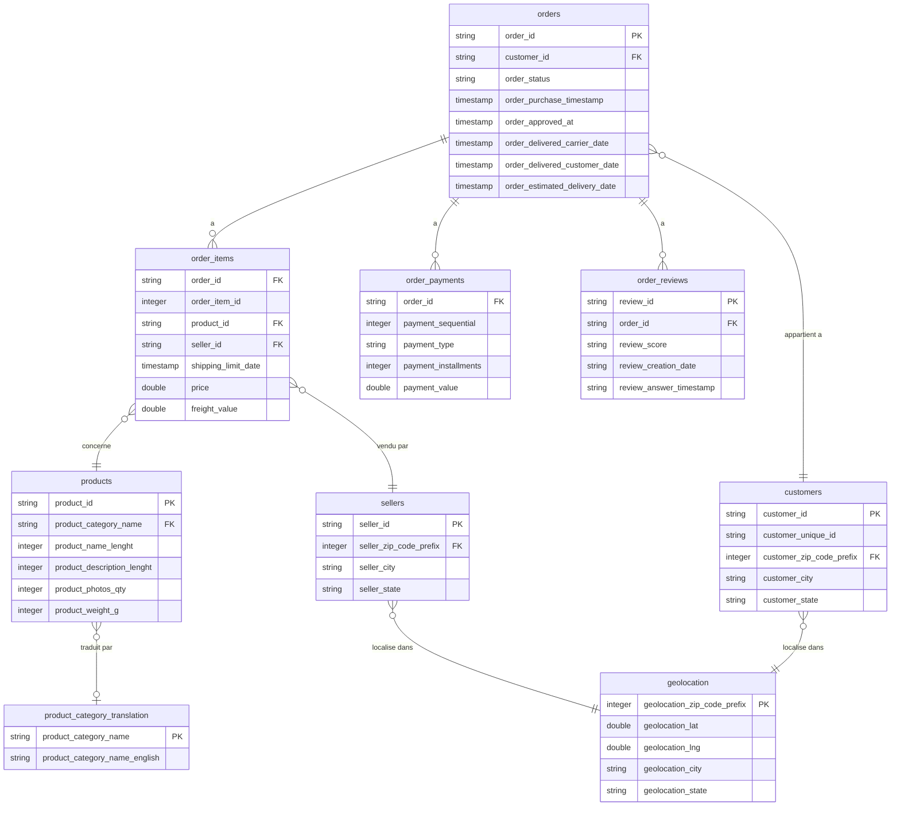

# Modèle de données — Olist E-Commerce

## Vue d'ensemble

Le dataset Olist représente l'activité d'un e-commerce brésilien, réparti sur 8 fichiers CSV bruts (zone `raw`) :

- `olist_orders_dataset.csv` — commandes
- `olist_customers_dataset.csv` — clients
- `olist_order_items_dataset.csv` — articles commandés
- `olist_order_payments_dataset.csv` — paiements
- `olist_products_dataset.csv` — produits
- `olist_sellers_dataset.csv` — vendeurs
- `olist_order_reviews_dataset.csv` — avis clients
- `olist_geolocation_dataset.csv` — géolocalisation
- `product_category_name_translation.csv` — traduction des catégories (PT → EN)

La table centrale est **orders**, reliée à la majorité des autres tables via `order_id`.

---

## Schémas des tables

### orders (99 441 lignes)

| Colonne | Type | Note |
|---|---|---|
| order_id | string | **PK** |
| customer_id | string | **FK** → customers.customer_id |
| order_status | string | |
| order_purchase_timestamp | timestamp | |
| order_approved_at | timestamp | |
| order_delivered_carrier_date | timestamp | |
| order_delivered_customer_date | timestamp | |
| order_estimated_delivery_date | timestamp | |

### customers (99 441 lignes)

| Colonne | Type | Note |
|---|---|---|
| customer_id | string | **PK** |
| customer_unique_id | string | identifiant client réel (un client peut avoir plusieurs customer_id) |
| customer_zip_code_prefix | integer | **FK** → geolocation.geolocation_zip_code_prefix |
| customer_city | string | |
| customer_state | string | |

### order_items (112 650 lignes)

| Colonne | Type | Note |
|---|---|---|
| order_id | string | **FK** → orders.order_id |
| order_item_id | integer | partie de la PK composite (order_id + order_item_id) |
| product_id | string | **FK** → products.product_id |
| seller_id | string | **FK** → sellers.seller_id |
| shipping_limit_date | timestamp | |
| price | double | |
| freight_value | double | |

### order_payments (103 886 lignes)

| Colonne | Type | Note |
|---|---|---|
| order_id | string | **FK** → orders.order_id |
| payment_sequential | integer | numéro de séquence du paiement |
| payment_type | string | |
| payment_installments | integer | nombre de mensualités |
| payment_value | double | |

### order_reviews (104 162 lignes)

| Colonne | Type | Note |
|---|---|---|
| review_id | string | **PK** |
| order_id | string | **FK** → orders.order_id |
| review_score | string | ⚠️ devrait être `integer` |
| review_comment_title | string | beaucoup de NULL |
| review_comment_message | string | beaucoup de NULL |
| review_creation_date | timestamp |
| review_answer_timestamp | timestamp |

### products (32 951 lignes)

| Colonne | Type | Note |
|---|---|---|
| product_id | string | **PK** |
| product_category_name | string | **FK** → product_category_translation.product_category_name |
| product_name_lenght | integer | |
| product_description_lenght | integer | |
| product_photos_qty | integer | |
| product_weight_g | integer | |
| product_length_cm | integer | |
| product_height_cm | integer | |
| product_width_cm | integer | |

### sellers (3 095 lignes)

| Colonne | Type | Note |
|---|---|---|
| seller_id | string | **PK** |
| seller_zip_code_prefix | integer | **FK** → geolocation.geolocation_zip_code_prefix |
| seller_city | string | |
| seller_state | string | |

### geolocation (1 000 163 lignes)

| Colonne | Type | Note |
|---|---|---|
| geolocation_zip_code_prefix | integer | clé de jointure, **non unique** (doublons) |
| geolocation_lat | double | |
| geolocation_lng | double | |
| geolocation_city | string | |
| geolocation_state | string | |

### product_category_translation (71 lignes)

| Colonne | Type | Note |
|---|---|---|
| product_category_name | string | **PK**, **FK** ← products.product_category_name |
| product_category_name_english | string | |

---

## Relations et jointures

| Table A | Table B | Clé de jointure | Cardinalité | Type de join recommandé | Justification |
|---|---|---|---|---|---|
| orders | customers | customer_id | N:1 | INNER | chaque commande a toujours un client |
| orders | order_items | order_id | 1:N | INNER | une commande sans article n'a pas de sens métier |
| orders | order_payments | order_id | 1:N | LEFT | vérifier s'il existe des commandes sans paiement enregistré |
| orders | order_reviews | order_id | 1:0 ou 1:1 | LEFT | toutes les commandes n'ont pas reçu d'avis |
| order_items | products | product_id | N:1 | LEFT | vérifier l'existence de product_id orphelins |
| order_items | sellers | seller_id | N:1 | INNER | un article est toujours vendu par un vendeur identifié |
| products | product_category_translation | product_category_name | N:1 | LEFT | certaines catégories peuvent être NULL ou absentes de la table de traduction |
| customers | geolocation | customer_zip_code_prefix = geolocation_zip_code_prefix | N:N | LEFT, après agrégation | geolocation contient des doublons par CEP |
| sellers | geolocation | seller_zip_code_prefix = geolocation_zip_code_prefix | N:N | LEFT, après agrégation | idem |

---

## Problèmes identifiés dès l'inspection du schéma (zone bronze)

Ces points sont à traiter lors du passage bronze → silver (mercredi) :

1. **`review_score`** inféré en `string` par Spark — doit être casté en `integer` pour permettre les agrégations (note moyenne, etc.).
2. **`geolocation`** contient de nombreux doublons pour un même `zip_code_prefix` (coordonnées légèrement différentes). Une agrégation (moyenne de lat/lng, ou première occurrence) est nécessaire avant toute jointure, sous peine de dupliquer les lignes de `customers` ou `sellers`.
3. **Cohérence des types de zip code** entre `customers`, `sellers` et `geolocation` — tous en `integer` ici, mais à revérifier après nettoyage (un CEP commençant par 0 perdrait son zéro en integer).
4. **Valeurs NULL** dans `review_comment_title` et `review_comment_message` — attendu, ce ne sont pas des champs obligatoires, mais à documenter dans le rapport qualité.
5. **`product_category_name`** peut être NULL pour certains produits — à gérer (catégorie "non renseignée" plutôt que suppression de la ligne).

---

## Diagramme ERD

---

## Prochaines étapes (zone silver)

- Caster `review_score` en `integer`
- Convertir `review_creation_date` et `review_answer_timestamp` en `timestamp`
- Agréger `geolocation` par `zip_code_prefix`
- Vérifier les valeurs nulles dans toutes les tables et documenter les décisions de traitement
- Détecter les doublons (`order_id`, `product_id`, etc.)
- Exporter les tables nettoyées en Parquet dans `output/silver/`
